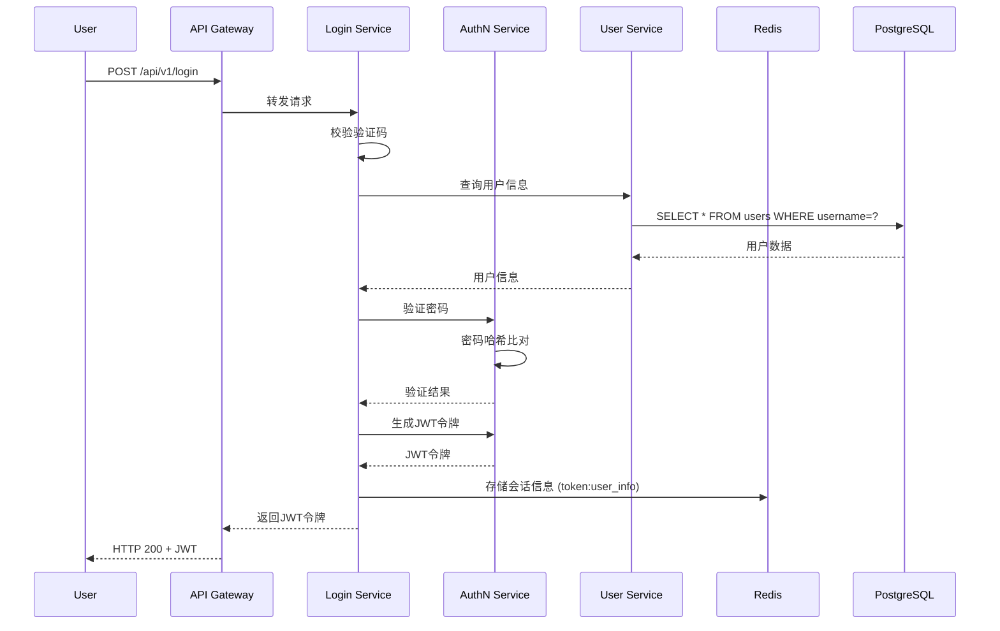
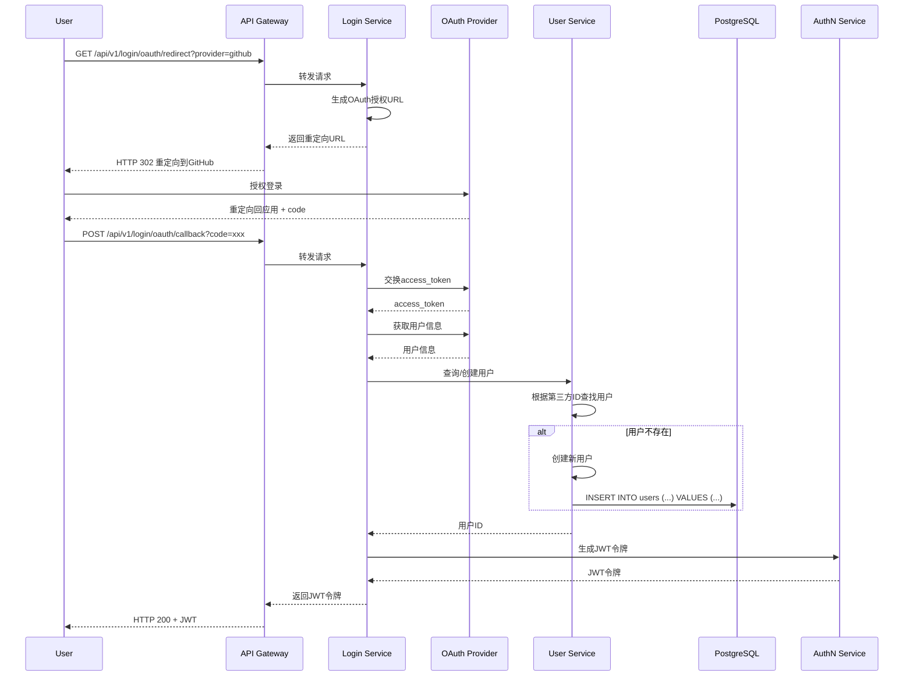

## 登录模块设计
用户名/密码登录

```mermaid
sequenceDiagram
    participant User
    participant API Gateway
    participant Login Service
    participant AuthN Service
    participant User Service
    participant Redis
    participant PostgreSQL
    
    User->>API Gateway: POST /api/v1/login
    API Gateway->>Login Service: 转发请求
    Login Service->>Login Service: 校验验证码
    Login Service->>User Service: 查询用户信息
    User Service->>PostgreSQL: SELECT * FROM users WHERE username=?
    PostgreSQL-->>User Service: 用户数据
    User Service-->>Login Service: 用户信息
    Login Service->>AuthN Service: 验证密码
    AuthN Service->>AuthN Service: 密码哈希比对
    AuthN Service-->>Login Service: 验证结果
    Login Service->>AuthN Service: 生成JWT令牌
    AuthN Service-->>Login Service: JWT令牌
    Login Service->>Redis: 存储会话信息 (token:user_info)
    Login Service-->>API Gateway: 返回JWT令牌
    API Gateway-->>User: HTTP 200 + JWT
```

第三方登录流程

```mermaid
sequenceDiagram
    participant User
    participant API Gateway
    participant Login Service
    participant OAuth Provider
    participant User Service
    
    User->>API Gateway: GET /api/v1/login/oauth/redirect?provider=github
    API Gateway->>Login Service: 转发请求
    Login Service->>Login Service: 生成OAuth授权URL
    Login Service-->>API Gateway: 返回重定向URL
    API Gateway-->>User: HTTP 302 重定向到GitHub
    User->>OAuth Provider: 授权登录
    OAuth Provider-->>User: 重定向回应用 + code
    User->>API Gateway: POST /api/v1/login/oauth/callback?code=xxx
    API Gateway->>Login Service: 转发请求
    Login Service->>OAuth Provider: 交换access_token
    OAuth Provider-->>Login Service: access_token
    Login Service->>OAuth Provider: 获取用户信息
    OAuth Provider-->>Login Service: 用户信息
    Login Service->>User Service: 查询/创建用户
    User Service->>User Service: 根据第三方ID查找用户
    alt 用户不存在
        User Service->>User Service: 创建新用户
        User Service->>PostgreSQL: INSERT INTO users (...) VALUES (...)
    end
    User Service-->>Login Service: 用户ID
    Login Service->>AuthN Service: 生成JWT令牌
    AuthN Service-->>Login Service: JWT令牌
    Login Service-->>API Gateway: 返回JWT令牌
    API Gateway-->>User: HTTP 200 + JWT
```

